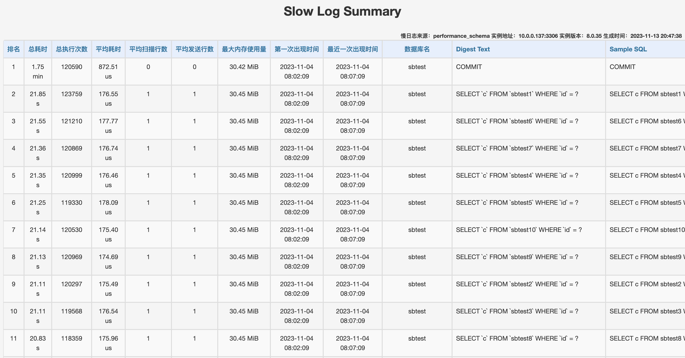
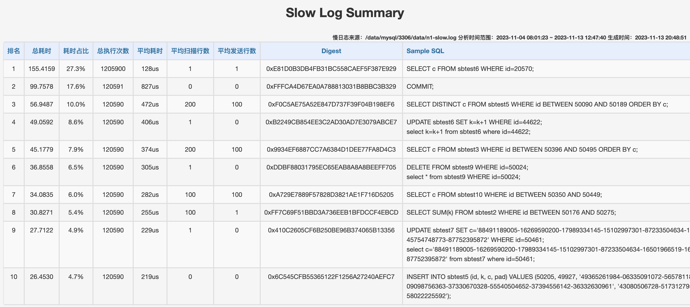

# slow-log-summary
在分析慢日志时，DBA 常用的一个工具是`pt-query-digest`（Percona Toolkit 中的一个工具，具体什么是 Percona Toolkit 及 Percona Toolkit 如何安装，可参考：[MySQL 中如何归档数据](http://mp.weixin.qq.com/s?__biz=Mzg5OTY2MjU5MQ==&mid=2247485439&idx=1&sn=943f1bb046a3ef3ac724615dcb4a8fd1&chksm=c04e906ff7391979bfdfd7b35b7d84cda9888b2259d5d606a9aaac4a50608e182b2febab42c8#rd)）。

该工具可对慢日志进行汇总分析，生成一个慢查询汇总报告（报告的具体内容，后面有展示）。

虽然这个报告很实用，但这种方式其实也有不少的痛点：

- 工具如何使用和怎么读懂报告有一定的学习成本。

- DBA 需要时间来分析这个报告，才能告诉开发童鞋哪些 SQL 需要优化。

  虽然报告的可读性已经非常好了，但离开发童鞋的要求（直接告诉我哪些 SQL 需要优化，当然，最好也能给出优化建议）还是有一定的差距。

- 如果开发童鞋想要进行分析呢？对不起，他们一般没有服务器登录权限，拿不到慢日志。

下面分享的工具（`slow-log-summary`）能有效解决这些痛点：

- 该工具会生成一个慢查询汇总报告。每一类 SQL 是一行。执行总耗时越久的 SQL，排名樾靠前，也最值得优化。

- 报告是 HTML 格式，方便发送日报。

- 对于习惯使用慢日志和`pt-query-digest`的童鞋（主要是DBA），该工具会直接基于`pt-query-digest`分析后的结果生成一个 HTML 报告，省去了分析的时间。

- 对于不方便获取慢日志的童鞋（主要是开发），可直接从 performance_schema 中获取 SQL 的执行耗时分布情况。

  

# 工具地址

项目地址：https://github.com/slowtech/slow-log-summary

可直接下载二进制包，也可进行源码编译。

### 直接下载二进制包

```bash
# wget https://github.com/slowtech/slow-log-summary/releases/download/v1.0.0/slow-log-summary-linux-amd64.tar.gz
# tar xvf slow-log-summary-linux-amd64.tar.gz
```

解压后，会在当前目录生成一个名为 `slow-log-summary` 的可执行文件。

### 源码编译

```bash
# wget https://github.com/slowtech/slow-log-summary/archive/refs/tags/v1.0.0.tar.gz
# tar xvf v1.0.0.tar.gz
# cd slow-log-summary-1.0.0
# go build -o slow-log-summary slow_log_summary.go
```

编译完成后，会在当前目录生成一个名为 `slow_log_summary `的可执行文件。


# 参数解析

```bash
# ./slow-log-summary --help
slow-log-summary version: 1.0.0
Usage:
slow-log-summary -source <source_type> -r <output_file> [other options]

Example:
./slow-log-summary -source perf -h 10.0.0.168 -P 3306 -u root -p '123456'
./slow-log-summary -source slowlog -pt /usr/local/bin/pt-query-digest -slowlog /data/mysql/3306/data/n1-slow.log

Common Options:
  -help
    Display usage

Source Type Options:
  -source string
    Slow log source: 'perf' or 'slowlog' (default "perf")

Output File Options:
  -r string
    Direct output to a given file (default "/tmp/slow-log-summary-20060102-150405.html")

Options when source is 'perf':
  -h string
    MySQL host (default "localhost")
  -P int
    MySQL port (default 3306)
  -u string
    MySQL username (default "root")
  -p string
    MySQL password
  -D string
    MySQL database (default "performance_schema")

Options when source is 'slowlog':
  -pt string
    Absolute path for pt-query-digest. Example: /usr/local/bin/pt-query-digest
  -slowlog string
    Absolute path for slowlog. Example: /var/log/mysql/node1-slow.log
  -since string
    Parse only queries newer than this value, YYYY-MM-DD [HH:MM:SS]
  -until string
    Parse only queries older than this value, YYYY-MM-DD [HH:MM:SS]
  -yday
    Parse yesterday's slowlog
```

其中，

- -source：指定慢查询汇总报告的来源。可设置 perf（performance_schema），也可设置 slowlog（慢日志 + pt-query-digest）。
- -r：慢查询汇总报告文件名。如果不指定，则默认为 "/tmp/slow-log-summary-当前时间.html"，例如 `/tmp/slow-log-summary-20060102-150405.html`。

当 source 设置为 perf 时，我们需要设置实例的连接信息，包括：

- -h：主机名，默认是 localhost。
- -P：端口，默认是 3306。
- -u：用户名，默认是 root。
- -p：密码。
- -D：库名，默认是 performance_schema。

当 source 设置为 slowlog 时，因为该工具是基于`pt-query-digest`对慢日志进行分析，所以需要通过 -pt 设置`pt-query-digest`的绝对路径和 -slowlog 设置慢日志的绝对路径。

除此之外，还可指定分析的时间范围，默认是分析整个慢日志，也可指定 -yday 只分析昨天的慢日志，或者通过 -since 和 -until 指定具体的开始时间和结束时间。


# 常见用法

### 基于 performance_schema 生成慢查询报告

```bash
# ./slow-log-summary -source perf -h 10.0.0.137 -P 3306 -u root -p 123456 -r slow-log-summary.html
Output written to file slow-log-summary.html

不在命令行中指定密码
# ./slow-log-summary -source perf -h 10.0.0.137 -P 3306 -u root
Enter MySQL password:
Output written to file /tmp/slow-log-summary-20231113-204738.html
```


### 基于慢日志和 pt-query-digest 生成慢查询报告

**分析整个慢日志**

```bash
# ./slow-log-summary -source slowlog -pt /usr/local/bin/pt-query-digest -slowlog /data/mysql/3306/data/n1-slow.log
```


**分析昨天的慢日志**

```bash
# ./slow-log-summary -source slowlog -pt /usr/local/bin/pt-query-digest -slowlog /data/mysql/3306/data/n1-slow.log -yday
```


**分析指定时间段的慢日志**

```bash
# ./slow-log-summary -source slowlog -pt /usr/local/bin/pt-query-digest -slowlog /data/mysql/3306/data/n1-slow.log -since '2023-11-04 08:01:00' -until '2023-11-04 08:10:00'
```


# 工具效果

### performance_schema

下面是基于 performance_schema 生成的查询耗时汇总报告：

注意，

1. 报告右上角的“生成时间”是中国时区时间，而报告中 SQL 的“第一次出现时间”和“最近一次出现时间”是原样输出，没有进行时区转换，具体是什么时区下的时间取决于实例的 time_zone。
2. Digest Text 的长度由 performance_schema_max_digest_length 参数控制，默认是 1024。
3. Sample SQL 的长度由 performance_schema_max_sql_text_length 参数控制，默认是 1024。
4. 对于 MySQL 8.0 之前的版本，报告中只会显示 Digest Text（规范化语句摘要），不会显示 Sample SQL（一类 SQL 中一个具体的 SQL 语句）。Sample SQL 是 MySQL 8.0 才开始支持的。
5. 对于 MySQL 8.0.31 开始的版本，报告中还会显示语句的最大内存使用量。
6. 对于 MySQL 8.0.28 开始的版本，如果 performance_schema.setup_consumers 中 CPU 相关的配置开启了（默认没有开启），报告中还会显示语句的CPU平均耗时。

```sql
UPDATE performance_schema.setup_consumers SET ENABLED = 'YES' WHERE NAME='events_statements_cpu';
```


### 慢日志 + pt-query-digest

下面是基于慢日志 + pt-query-digest 生成的慢查询汇总报告：

报告中的 Digest 是 Digest Text（规范化语句摘要）对应的哈希值。

如果我们想看某一类 SQL 更详细的统计信息，可通过该类 SQL 的 Digest，去`pt-query-digest`的原始报告中找。


# 实现思路

### performance_schema

performance_schema 这种方式是直接读取`performance_schema.events_statements_summary_by_digest`表中的数据。

该表按照 SCHEMA_NAME 和 DIGEST 对 MySQL 服务端执行的 SQL 进行分类统计，会统计这类 SQL 性能相关的指标，例如总耗时、执行次数、扫描行数、发送行数等，具体指标如下所示。

```sql
mysql> select * from performance_schema.events_statements_summary_by_digest limit 1\G
*************************** 1. row ***************************
                SCHEMA_NAME: NULL
                     DIGEST: 44e35cee979ba420eb49a8471f852bbe15b403c89742704817dfbaace0d99dbb
                DIGEST_TEXT: SELECT @@`version_comment` LIMIT ?
                 COUNT_STAR: 18
             SUM_TIMER_WAIT: 59547311000
             MIN_TIMER_WAIT: 153661000
             AVG_TIMER_WAIT: 3308183000
             MAX_TIMER_WAIT: 18769205000
              SUM_LOCK_TIME: 0
                 SUM_ERRORS: 0
               SUM_WARNINGS: 0
          SUM_ROWS_AFFECTED: 0
              SUM_ROWS_SENT: 18
          SUM_ROWS_EXAMINED: 18
SUM_CREATED_TMP_DISK_TABLES: 0
     SUM_CREATED_TMP_TABLES: 0
       SUM_SELECT_FULL_JOIN: 0
 SUM_SELECT_FULL_RANGE_JOIN: 0
           SUM_SELECT_RANGE: 0
     SUM_SELECT_RANGE_CHECK: 0
            SUM_SELECT_SCAN: 0
      SUM_SORT_MERGE_PASSES: 0
             SUM_SORT_RANGE: 0
              SUM_SORT_ROWS: 0
              SUM_SORT_SCAN: 0
          SUM_NO_INDEX_USED: 0
     SUM_NO_GOOD_INDEX_USED: 0
               SUM_CPU_TIME: 355275000
      MAX_CONTROLLED_MEMORY: 16720
           MAX_TOTAL_MEMORY: 63457
            COUNT_SECONDARY: 0
                 FIRST_SEEN: 2023-11-04 08:01:11.564304
                  LAST_SEEN: 2023-11-13 12:57:20.357740
                QUANTILE_95: 19054607179
                QUANTILE_99: 19054607179
               QUANTILE_999: 19054607179
          QUERY_SAMPLE_TEXT: select @@version_comment limit 1
          QUERY_SAMPLE_SEEN: 2023-11-13 12:57:20.357740
    QUERY_SAMPLE_TIMER_WAIT: 275751000
1 row in set (0.00 sec)
```

该表是 MySQL 5.6 引入的，5.7 和 5.6 中的表结构基本一致，这里重点说说 MySQL 8.0 中新增的列：

- QUANTILE_95，QUANTILE_99，QUANTILE_999：QUANTILE_95 表示 95% 的语句的执行耗时低于或等于这个值。相对于平均值，这些指标对业务更有参考意义。

- QUERY_SAMPLE_TEXT，QUERY_SAMPLE_SEEN，QUERY_SAMPLE_TIMER_WAIT：MySQL 8.0 中引入的，给出了一个具体的 SQL、该 SQL 出现的时间和执行耗时情况。

  在 MySQL 8.0 之前，没有具体的 SQL，只有这类 SQL 的 DIGEST_TEXT，有时候想找开发童鞋理论，却总有种证据不够充分的感觉。

- MAX_CONTROLLED_MEMORY，MAX_TOTAL_MEMORY ：MySQL 8.0.31 中引入的，表示语句在执行过程中使用的最大受控内存量（由 connection_memory_limit 参数控制的内存）、最大内存量。

- SUM_CPU_TIME：CPU_TIME 是 MySQL 8.0.28 中引入的，表示当前线程在 CPU 上消耗的时间，单位皮秒（picoseconds）。

注意，events_statements_summary_by_digest 表的记录数由 performance_schema_digests_size 参数控制。

该参数虽然是基于 max_connections、table_definition_cache、table_open_cache 的值动态生成，但对于生产系统，一般默认是 10000。

如果记录数满了，Performance Schema 会将新的 SQL 的 SCHEMA_NAME 和 DIGEST 设置为 NULL，同时增加 Performance_schema_digest_lost 变量的值。

如果我们看到表中 SCHEMA_NAME 和 DIGEST 为 NULL 的记录中的 COUNT_STAR（执行次数）的值比较大，可适当调大 performance_schema_digests_size 的值。


### 慢日志 + pt-query-digest

pt-query-digest 对慢日志进行分析后，生成的汇总报告的内容如下：

\# pt-query-digest /data/mysql/3306/data/n1-slow.log

```bash
# 220.8s user time, 260ms system time, 20.53M rss, 175.02M vsz
# Current date: Mon Nov 13 13:27:12 2023
# Hostname: n1
# Files: /data/mysql/3306/data/n1-slow.log
# Overall: 2.41M total, 53 unique, 3.03 QPS, 0.00x concurrency ___________
# Time range: 2023-11-04T08:01:23 to 2023-11-13T13:12:25
# Attribute          total     min     max     avg     95%  stddev  median
# ============     ======= ======= ======= ======= ======= ======= =======
# Exec time           568s     1us   643ms   235us   424us     3ms   144us
# Lock time             4s       0   176ms     1us     1us   168us     1us
# Rows sent         35.77M       0     128   15.55   97.36   34.54    0.99
# Rows examine      70.51M       0     256   30.65  192.76   61.52    0.99
# Query size       126.30M       5   1.41k   54.91  234.30   50.86   34.95

-- 汇总部分 --
# Profile
# Rank Query ID                            Response time  Calls   R/Call V
# ==== =================================== ============== ======= ====== =
#    1 0xE81D0B3DB4FB31BC558CAEF5F387E929  155.4159 27.3% 1205900 0.0001  0.00 SELECT sbtest?
#    2 0xFFFCA4D67EA0A788813031B8BBC3B329   99.7578 17.6%  120591 0.0008  0.10 COMMIT
#    3 0xF0C5AE75A52E847D737F39F04B198EF6   56.9487 10.0%  120590 0.0005  0.00 SELECT sbtest?
#    4 0xB2249CB854EE3C2AD30AD7E3079ABCE7   49.0592  8.6%  120590 0.0004  0.07 UPDATE sbtest?
#    5 0x9934EF6887CC7A6384D1DEE77FA8D4C3   45.1779  7.9%  120590 0.0004  0.00 SELECT sbtest?
#    6 0xDDBF88031795EC65EAB8A8A8BEEFF705   36.8558  6.5%  120590 0.0003  0.06 DELETE sbtest?
#    7 0xA729E7889F57828D3821AE1F716D5205   34.0835  6.0%  120590 0.0003  0.00 SELECT sbtest?
#    8 0xFF7C69F51BBD3A736EEB1BFDCCF4EBCD   30.8271  5.4%  120590 0.0003  0.00 SELECT sbtest?
#    9 0x410C2605CF6B250BE96B374065B13356   27.7122  4.9%  120590 0.0002  0.02 UPDATE sbtest?
#   10 0x6C545CFB55365122F1256A27240AEFC7   26.4530  4.7%  120590 0.0002  0.01 INSERT sbtest?
# MISC 0xMISC                                6.1028  1.1%  120849 0.0001   0.0 <43 ITEMS>

-- 明细部分 --
# Query 1: 4.02k QPS, 0.52x concurrency, ID 0xE81D0B3DB4FB31BC558CAEF5F387E929 at byte 493647221
# Scores: V/M = 0.00
# Time range: 2023-11-04T08:02:09 to 2023-11-04T08:07:09
# Attribute    pct   total     min     max     avg     95%  stddev  median
# ============ === ======= ======= ======= ======= ======= ======= =======
# Count         49 1205900
# Exec time     27    155s    47us   317ms   128us   194us   356us   108us
# Lock time     40      2s       0     4ms     1us     1us     7us     1us
# Rows sent      3   1.15M       1       1       1       1       0       1
# Rows examine   1   1.15M       1       1       1       1       0       1
# Query size    32  41.52M      36      37   36.10   36.69    0.50   34.95
# String:
# Databases    sbtest
# Hosts        10.0.0.198
# Users        root
# Query_time distribution
#   1us
#  10us  ############################
# 100us  ################################################################
#   1ms  #
#  10ms  #
# 100ms  #
#    1s
#  10s+
# Tables
#    SHOW TABLE STATUS FROM `sbtest` LIKE 'sbtest6'\G
#    SHOW CREATE TABLE `sbtest`.`sbtest6`\G
# EXPLAIN /*!50100 PARTITIONS*/
SELECT c FROM sbtest6 WHERE id=20570\G
...
```

报告主要包括两大部分：Profile （汇总）部分和明细部分。

汇总部分对每一类 SQL 按照总的执行时间进行了排序。

通过汇总部分，我们可以直观地看到哪类 SQL 执行耗时最久、执行次数最多。

而明细部分则提供了每一类 SQL 具体的执行信息。

明细部分最后，会给出这类 SQL 执行时间最久的那个 SQL 作为示例 SQL。

如果示例 SQL 是 DELETE、UPDATE 语句，`pt-query-digest` 还会将其转化为 SELECT 语句一并输出，如

```sql
UPDATE sbtest6 SET k=k+1 WHERE id=44622\G
# Converted for EXPLAIN
# EXPLAIN /*!50100 PARTITIONS*/
select  k=k+1 from sbtest6 where  id=44622\G
```

之所以会这么处理，是因为在 MySQL 5.6 之前，`EXPLAIN` 命令不支持 DML 语句。

所以，如果我们在`slow-log-summary`的报告中，看到类似下面的示例 SQL，不要奇怪。实际上，它就是一条 UPDATE 语句。

```sql
UPDATE sbtest6 SET k=k+1 WHERE id=44622;
select  k=k+1 from sbtest6 where  id=44622;
```

说回`slow-log-summary`。

`slow-log-summary`报告中的排名、总耗时、耗时占比、总执行次数、Digest 实际上取的就是 Profile 部分的 Rank、Response time、Calls 和 Query ID。

接着，我们会基于 Query ID 从明细部分拿到各类 SQL 的 Exec time(avg)、Rows sent(avg) 、Rows examine(avg) 和示例 SQL。

# 总结

最后，我们对比下这两种采集方式的优缺点：

### performance_schema

优点：

- 简单方便，可远程获取。

- 对数据库性能影响较小。

- 性能相关的指标比较全面。

  HTML 报告中只展示了一部分，如果需要其它指标，大家可留言或自行修改源码。

缺点：

- 实例关闭，events_statements_summary_by_digest 中的数据就会被清空。

- events_statements_summary_by_digest 不会记录 Prepared Statement。

- 有限的明细数据。

  虽然 mysql 执行过的 SQL 会存储在 events_statements_xxx 表中，但这些表的容量毕竟有限。一旦超过限制，之前的记录就会被覆盖。所以如果要基于明细数据来定位问题，很可能记录就不存在。

  

### 慢日志 + pt-query-digest

优点：

- 会记录每条慢日志，方便我们定位问题。

缺点：

- 开启慢日志，对数据库性能会有一定的影响。
- 性能相关的指标较少。
- 慢日志存储在服务器上。如果没有服务器登录权限，分析起来就会比较麻烦。
- 需要安装`pt-query-digest`。而很多对安全比较敏感的环境禁止在服务器上下载和安装第三方工具。
